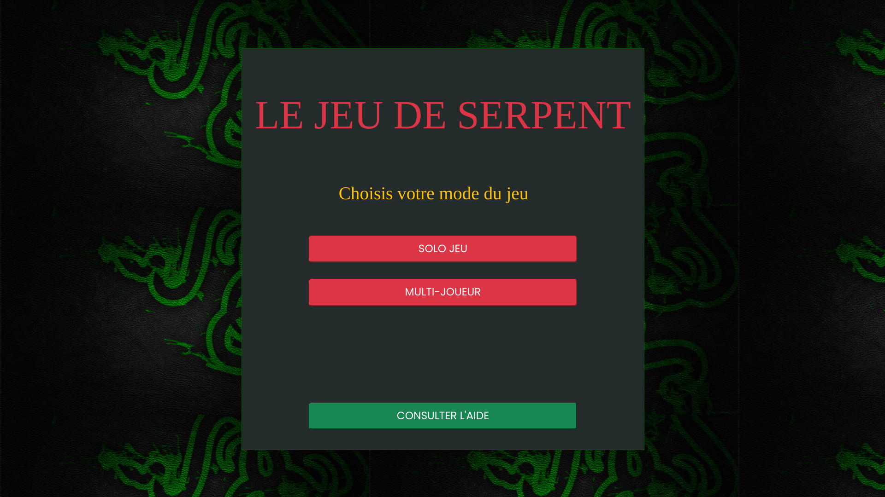
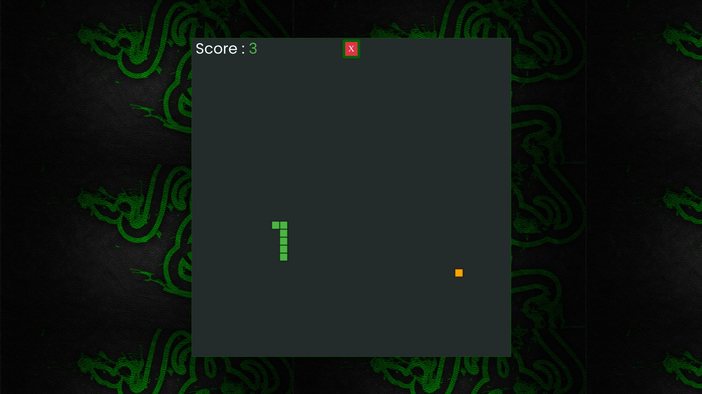
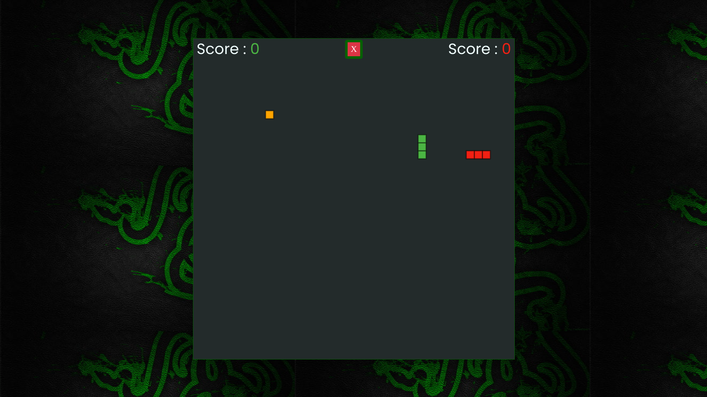
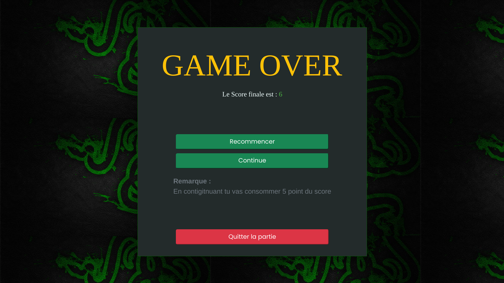
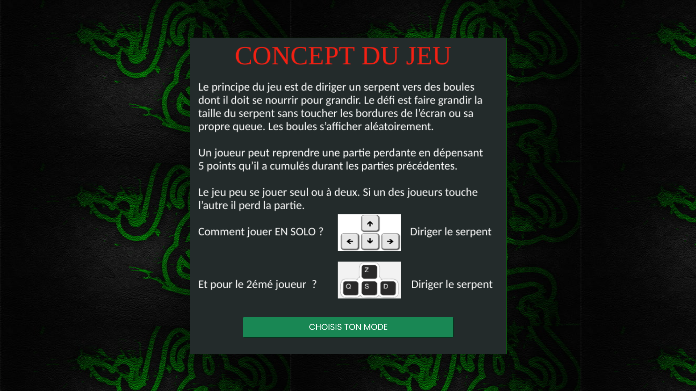

# Snake Game

This is a classic Snake Game developed using JavaScript, HTML, and CSS. The game offers both single-player and multiplayer modes, where players control their snakes to collect food and grow in size. The challenge is to avoid hitting the walls, your own tail, or the other player's snake in multiplayer mode.

## Table of Contents

- [Game Features](#game-features)
- [Installation](#installation)
- [How to Play](#how-to-play)
- [Screenshots](#screenshots)
- [Technologies Used](#technologies-used)
- [Contributing](#contributing)
- [License](#license)

## Game Features

- **Single-Player Mode**: Control the snake using the arrow keys, collect food, and avoid the walls to survive as long as possible.
- **Multiplayer Mode**: Two players can play simultaneously. The first player uses the arrow keys, and the second player uses the `W`, `A`, `S`, `D` keys.
- **Pause and Continue**: In single-player mode, you can pause the game and continue by consuming 5 points from your score.
- **Game Over**: The game ends if the snake hits the wall, its own tail, or in multiplayer mode, if one snake collides with the other.

## Installation

1. Clone the repository to your local machine:
   ```bash
   git clone https://github.com/Ilyass-Bezaiz/snake-game.git
   ```

2. Navigate to the project directory:
   ```bash
   cd snake-game
   ```

3. Open the `index.html` file in your preferred web browser.

## How to Play

- **Single-Player Mode**: Click on "SOLO JEU" to start the game. Use the arrow keys to control the snake.
- **Multiplayer Mode**: Click on "MULTI-JOUEUR" to start a multiplayer game. Player 1 uses the arrow keys, and Player 2 uses `W`, `A`, `S`, `D` to control their respective snakes.
- **Restart**: If you lose, click on the "Recommencer" button to restart the game.
- **Quit**: Click on "Quitter la partie" to exit the game.

## Screenshots

### Main Menu


### Single-Player Mode


### Multiplayer Mode


### Game Over Screen


### Consult Help Screen


## Technologies Used

- **HTML5**: Markup language used to structure the game.
- **CSS3**: Stylesheets for the game UI.
- **JavaScript**: The main programming language used to create the game logic.
- **Bootstrap**: For responsive design and UI components.

## Contributing

If you would like to contribute to this project, feel free to fork the repository and submit a pull request.

## License

This project is licensed under the MIT License. See the [LICENSE](LICENSE) file for more details.
